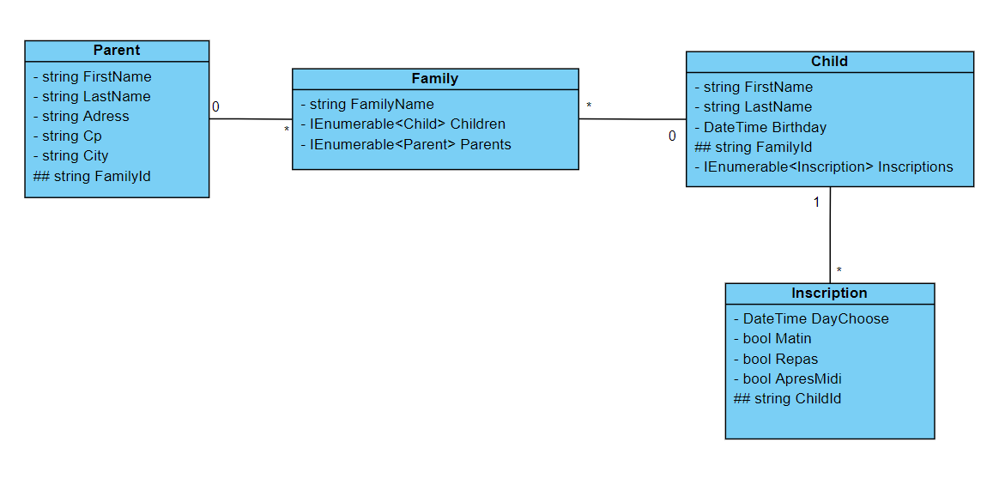
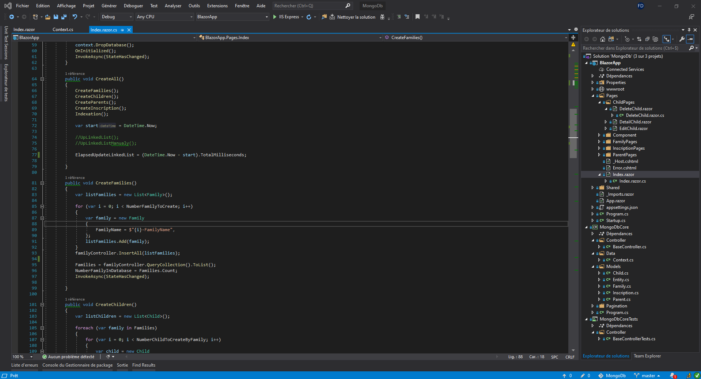
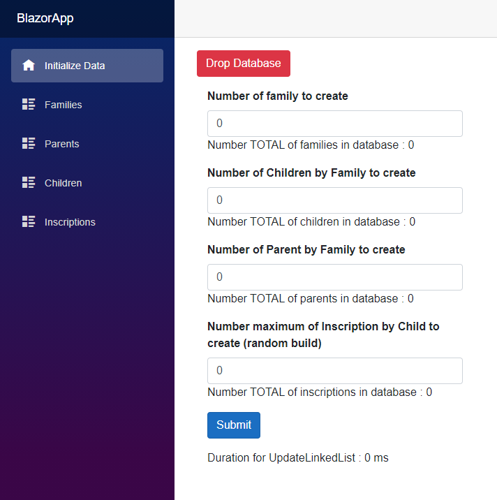
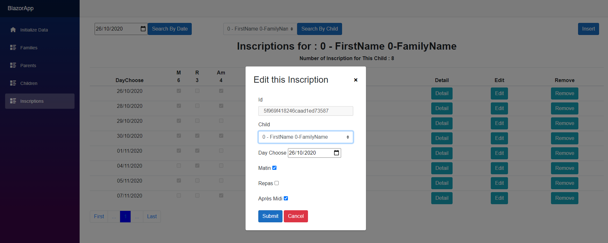
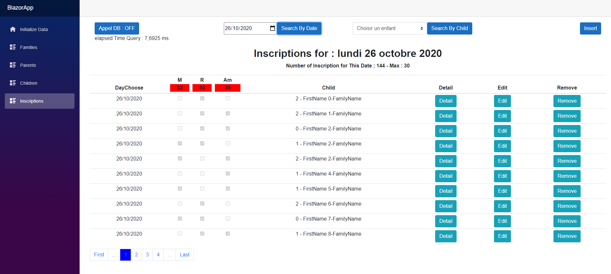

# SolutionMongoDb

## Installation ##

Installer MongoDb En local : https://www.mongodb.com/try/download/community version Community Server 4.4.1 (zip).
Installer MongoDb Compass afin de visualiser les enregistrements https://www.mongodb.com/products/compass

Si vous avez déjà MongoDb d'installé, vous pouvez modifier la ``Connextion String`` dans le fichier ``MongoDbCore/Data/Context``.

## L'application

L'application est un POC. 

Elle a été développé en C# .NET Core 3.1 en Blazor Server **SANS** Entity Framework Core.
**Toutes les relations sont traitées par le code.**

L'application permet de sauvegarder une famille dans une base de données et elle permet de simuler les inscriptions des enfants pour un jour précis.

L'utilisation de MongoDb permet d'enregistrer les données en cascade à l'intérieur d'une entité. 
Par exemple, il est possible d'enregitrer les enfants et les parents d'une famille à l'intérieur même de l'entité famille. 
Si l'on souhaite utiliser cette fonctionalité, il faut décommenter soit la ligne 74 soit la ligne 75 dans ``BlazorApp/Pages/Index.razor.cs``

Afin de maintenir les relations, on utilise les méthodes ``UpdateLinkedList`` et ``DeleteLinkedList`` provenant du ``BaseController``. 
Ces méthodes utilisent la **reflexion** afin d'avoir un code génrérique. 

## Lancement de l'application ##

La première page permet de peupler la base de données. 

Les différentes pages permettent de visualiser les listes des différentes entités. 

Afin de faciliter la lecture un système de pagination a été développé. 

L'utilisation de la librairie ``BlazoredModal`` permet d'avoir des fenêtres modales. 

## Fonctionnalités remarquables

La solution est découpé selon le pattern MVC.

Les ``Vues`` correspondent au projet ``BlazorApp``. Les ``Models`` et la partie ``Controller`` sont dans le projet ``MongoDbCore``.

Bien qu'ils ne couvrent pas tout, des tests unitaires ont été développé dans le projet ``MongoDbCoreTests``.

Les ``Models`` dont on souhaite qu'ils soient sauvegardés en base de données héritent de de la classe ``Entity``.

La connexion s'effectue dans ``MongoDbCore/Data/Context`` .

Afin de manipuler les entités, un seul contrôleur générique est nécessaire : ``BaseController<T>``.

Dans le cadre des **Entités Embedded**, la page ``Inscription`` permet de visualiser le temps de réponse avec ou sans appel à la base de données. 

``ElapsedTime `` correspond au temps que met la page afin de charger les inscriptions soit en faisant des appel en base de données soit en utilisant les données embedded. 

